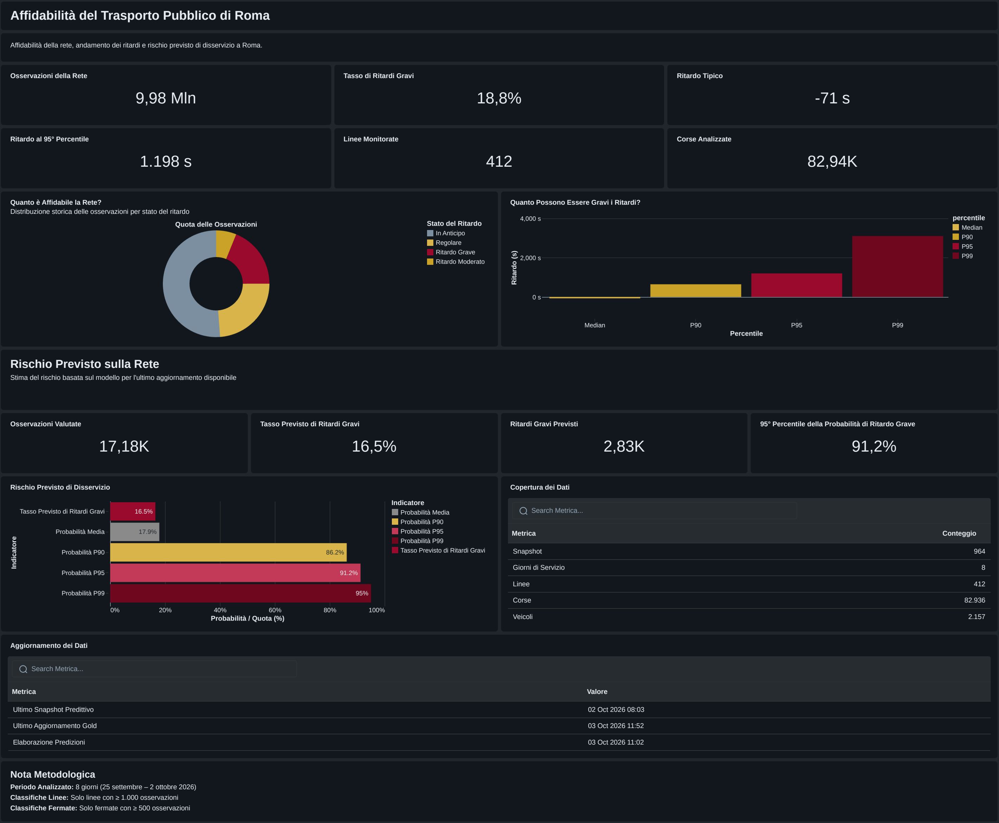
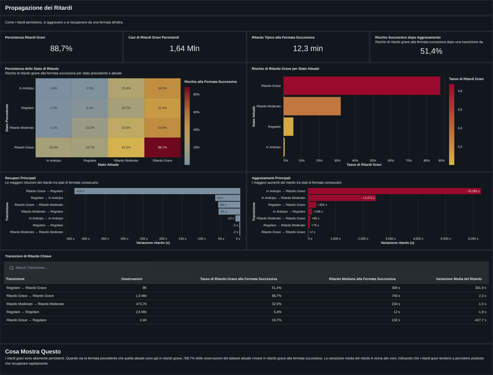
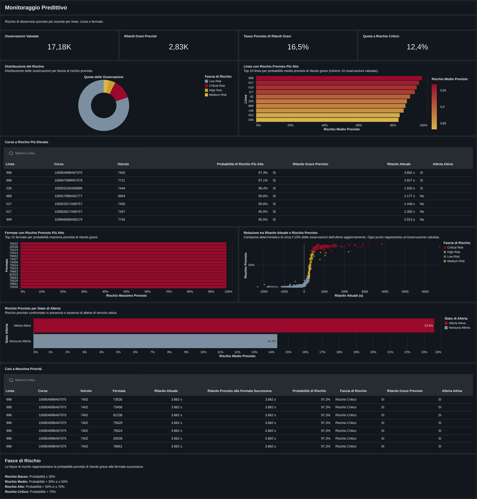
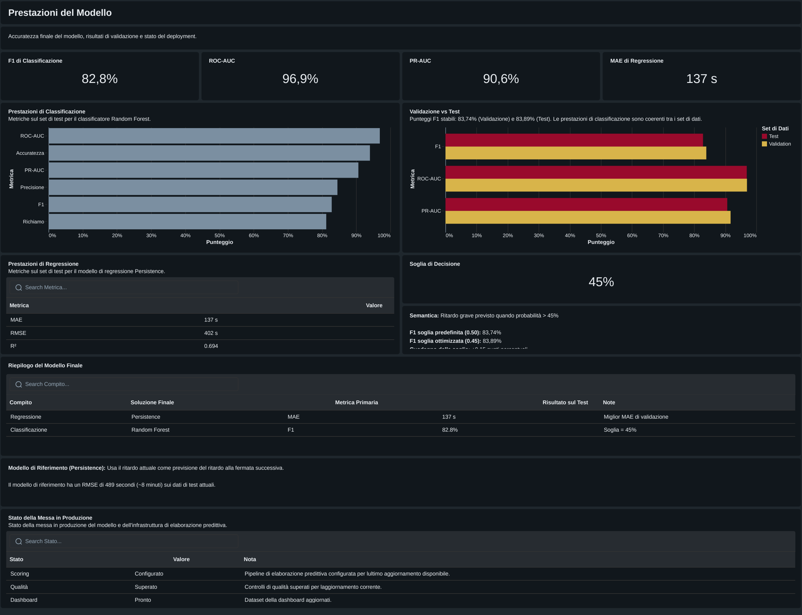

# Rome Public Transport Reliability & Delay Prediction

Un progetto end-to-end su Databricks che trasforma i feed del trasporto pubblico di Roma in analisi storiche dell'affidabilità, previsioni del ritardo alla fermata successiva e una dashboard operativa di Business Intelligence.

**Stack:** Databricks · Apache Spark / PySpark · Delta Lake · Unity Catalog · MLflow · Databricks SQL · Databricks AI/BI Dashboards · Python · SQL

**Stato al 7 ottobre 2026:** sono implementati il percorso dall'acquisizione dei dati alle analisi Gold e la dashboard Databricks su cinque pagine. Persistence è la soluzione finale di regressione; Random Forest è il classificatore finale. La registrazione del modello è rinviata per un limite dell'ambiente. Rimane da riconciliare una differenza tra le definizioni di ritardo grave adottate da ML e dashboard, descritta di seguito.

## Anteprima Dashboard

<p align="center">
  
</p>

## Problema di business

Quanto ritardo è prevedibile alla fermata successiva? Qual è la probabilità di un ritardo grave? Quali linee, fermate e fasce orarie presentano i maggiori problemi di affidabilità?

Il progetto affronta queste domande integrando Data Engineering, Feature Engineering temporale, confronto con baseline, valutazione ML, analisi SQL e BI. È un progetto di portfolio orientato alle esigenze degli operatori della mobilità locale; non implica un'adozione operativa da parte di Roma Capitale.

La [metodologia PACE](docs/PACE.md) documenta le motivazioni progettuali, le decisioni implementate, i risultati e gli scostamenti dal piano iniziale.

## Architettura

```text
Feed ufficiali GTFS Static + GTFS-Realtime
  → Bronze → Silver → Feature Engineering → Etichettatura con osservazioni future
  → ML / MLflow → batch scoring → Analisi Gold
  → Databricks SQL / Dashboard AI/BI
```

Le tabelle Delta sono governate tramite Unity Catalog. La dashboard interroga esclusivamente dataset Gold curati. Il tracciamento degli esperimenti con MLflow è completato; la registrazione degli artefatti del modello per l'uso in produzione è un passaggio distinto, ancora irrisolto.

## Fonti dei dati

I feed ufficiali di Roma Servizi per la Mobilità forniscono linee, corse, fermate, orari, calendari e tracciati GTFS Static, oltre a Trip Updates, Vehicle Positions e Service Alerts GTFS-Realtime. Un Job Databricks acquisisce i feed **ogni 10 minuti** e conserva le snapshot in un archivio storico Delta. `rome_transport.bronze.ingestion_runs` registra stato ed errori; le esecuzioni successive proseguono dopo errori transitori dei feed.

I file GTFS Static di riferimento rimangono localmente in `data/reference/gtfs_static/` e sono ignorati da Git per le loro dimensioni. Durante l'esecuzione, l'ingestion statica utilizza percorsi dei volumi Unity Catalog in Databricks.

## Pipeline e sequenza dei notebook

| Notebook | Responsabilità implementata |
| --- | --- |
| 01–03 | Configurazione dell'ambiente ed elaborazione GTFS Static nei livelli Bronze/Silver |
| 04–05 | Acquisizione realtime, raccolta pianificata e audit dell'ingestion |
| 06–07 | Silver realtime, associazione causale delle posizioni e arricchimento con orari e avvisi |
| 08 | Feature temporali, delle fermate precedenti, dei veicoli, spaziali, degli avvisi e dello storico |
| 09 | Etichettatura futura della fermata successiva, provenienza e filtro di qualità delle etichette |
| 10 | Confronto tra baseline ed esperimenti di regressione/classificazione |
| 11 | Tuning su validation, selezione finale e valutazione TEST a decisioni congelate |
| 12 | Tentativo di registrazione e batch scoring con impostazione assimilabile alla produzione |
| 13 | Analisi Gold, controlli di qualità e metadati di aggiornamento |
| 99 | Controlli sullo stato della pipeline realtime |

I principali passaggi analitici sono `rome_transport.silver.realtime_enriched_observations`, `rome_transport.features.next_stop_delay_features` e `rome_transport.features.next_stop_delay_labeled`.

## Qualità dei dati e prevenzione del leakage

- Le posizioni dei veicoli sono associate con un join **causal backward as-of**, su veicolo e corsa: sono ammesse solo posizioni precedenti o coincidenti con il timestamp del Trip Update, con anzianità massima di **180 secondi**.
- Lag e finestre mobili utilizzano le fermate precedenti nella stessa snapshot della corsa; gli aggregati storici utilizzano timestamp del feed strettamente precedenti.
- `target_realized_next_stop_delay_seconds` utilizza la prima snapshot successiva valida della stessa corsa, data di servizio e fermata target identificata da ID/sequenza, entro **30 minuti**. Il ritardo in arrivo ha priorità; quello in partenza è usato come alternativa quando disponibile.
- Gli esiti futuri servono esclusivamente come etichette. `provisional_next_stop_delay_seconds`, presente nella stessa snapshot, rimane riservato all'audit; target e provenienza delle etichette sono esclusi dagli input del modello e dagli output predittivi operativi.
- La valutazione utilizza gruppi cronologici di timestamp distinti, con ripartizione indicativa **70/15/15** tra train / validation / test. Il preprocessing viene stimato sul train; le etichette la cui disponibilità supera il confine con la partizione successiva vengono escluse dalla partizione precedente.
- Modelli, iperparametri e soglie decisionali sono selezionati su validation e congelati prima della valutazione TEST finale. Lo sbilanciamento delle classi viene valutato tramite precision, recall, F1 e PR-AUC della classe positiva, insieme all'accuracy.

### Filtro di qualità delle etichette realizzate

Il dataset esteso analizzato il 2 ottobre conteneva **10.007.020 righe etichettate prima del filtro finale di qualità**. I conteggi diagnostici erano cumulativi:

| Ritardo realizzato in valore assoluto | Righe |
| --- | ---: |
| > 1 ora | 104.719 |
| > 2 ore | 39.008 |
| > 4 ore | 33.850 |
| > 12 ore | 31.317 |

Le **31.317 etichette oltre ±12 ore rappresentano circa lo 0.31%** delle 10.007.020 etichette realizzate. Di queste, **31.249 ricadevano nelle ore del feed comprese tra le 21:00 e le 03:59**: circa il **99.8% del solo gruppo >12 ore**. Appena il **36.3%** di tale gruppo superava già ±12 ore nel target GTFS-RT provvisorio.

Questa concentrazione supporta l'interpretazione di artefatti legati al passaggio della mezzanotte, alla gestione del giorno di servizio GTFS e alla temporizzazione dei feed, anziché di ritardi operativi plausibili alla fermata successiva. La regola di inclusione nel training è:

```python
MAX_PLAUSIBLE_ABS_REALIZED_DELAY_SECONDS = 43200
```

```sql
ABS(target_realized_next_stop_delay_seconds) <= 43200
```

Si tratta di una **regola di qualità fondata su evidenze**, non di rimozione arbitraria degli outlier, winsorization, clipping o filtraggio guidato dal modello. I ritardi oltre 1, 2 o 4 ore rimangono ammissibili entro ±12 ore. Le etichette escluse non vengono alterate o corrette artificialmente; i target provvisori restano invariati.

Il filtro preserva ritardi severi ma plausibili ed evita che artefatti di circa 24–29 ore distorcano MAE, RMSE, media del target e training della regressione. Soglia ed evidenze rendono la decisione riproducibile e verificabile: non implicano che tutti i dati notturni siano invalidi, né che ±12 ore sia una soglia statisticamente ottimale o universalmente valida per GTFS. Il filtro è applicato: **10.007.020 - 31.317 = 9.975.703 osservazioni etichettate finali**.

## Dataset etichettato finale

`rome_transport.features.next_stop_delay_labeled` contiene **9.975.703 osservazioni dopo il filtro di qualità**.

| Copertura | Valore finale |
| --- | ---: |
| Snapshot realtime | 964 |
| Date di servizio | 8 |
| Linee | 412 |
| Corse | 82.936 |
| Veicoli | 2.157 |

I conteggi si riferiscono alle osservazioni: snapshot ripetute possono generare più righe per la stessa corsa e fermata. La copertura riguarda i feed etichettati, non l'intero servizio programmato né un'affidabilità ponderata per passeggeri.

## Risultati di Machine Learning

### Regressione: Persistence

È stato mantenuto l'approccio più solido nella validazione: prevedere `current_arrival_delay_seconds`, con **−71 secondi**, mediana del train, come valore sostitutivo quando il dato manca. I modelli di regressione più complessi non hanno prodotto un miglioramento sufficiente; non se ne afferma la superiorità rispetto a Persistence.

| Metrica TEST finale | Valore |
| --- | ---: |
| MAE | 136.9818 secondi |
| RMSE | 401.8525 secondi |
| R² | 0.6940 |
| WAPE | 0.3293 |

### Classificazione: RandomForestClassifier

Configurazione congelata: `numTrees=100`, `maxDepth=10`, `minInstancesPerNode=5`, `featureSubsetStrategy="sqrt"`, `maxBins=32`, `seed=42`.

```python
predicted_major_delay_flag = major_delay_probability > 0.45
```

Il confronto è **strettamente maggiore**: la soglia è stata fissata prima della valutazione TEST finale.

| Metrica TEST finale | Valore |
| --- | ---: |
| Accuracy | 0.9401 |
| Precision | 0.8450 |
| Recall | 0.8123 |
| F1 | 0.8283 |
| ROC-AUC | 0.9690 |
| PR-AUC | 0.9063 |

Sono risultati di valutazione congelati, non prestazioni ricalcolate sul riaddestramento con l'intero storico o sull'ultimo batch di scoring.

### Definizioni distinte: target ML e severità operativa della dashboard

Il classificatore ML è stato addestrato e valutato sul target `target_realized_major_delay_flag`: ritardo alla fermata successiva **>= 300 secondi**. Le metriche ML e le probabilità previste si riferiscono a questo target implementato.

La dashboard usa invece **Ritardo Grave > 600 secondi** nella tassonomia di severità operativa:

| Stato nella dashboard | Ritardo in secondi |
| --- | --- |
| In Anticipo | `< -60` |
| Regolare | `-60 <= delay <= 300` |
| Ritardo Moderato | `300 < delay <= 600` |
| Ritardo Grave | `> 600` |

Le due definizioni hanno finalità analitiche distinte e non sono intercambiabili. La loro armonizzazione rimane un **miglioramento metodologico futuro**; i risultati ML non devono essere reinterpretati come risultati validati per la soglia >600 secondi.

## Batch scoring e registrazione

`rome_transport.ml.next_stop_delay_predictions` contiene l'ultima snapshot valutata: **17.177 righe**, **2.831** previsioni con flag positivo e quota di ritardo grave previsto **0.16481**, applicando il confronto stretto `probability > 0.45`.

| Sintesi della probabilità di ritardo grave | Valore |
| --- | ---: |
| Media | 0.17923 |
| P90 | 0.86189 |
| P95 | 0.91219 |
| P99 | 0.95041 |

È batch scoring sull'ultima snapshot disponibile, con impostazione assimilabile alla produzione; non è un'API o un servizio di produzione in tempo reale. Un singolo batch non dimostra una tendenza predittiva né nuove prestazioni su dati mai osservati.

Tracciamento MLflow, selezione finale e scoring sono completati. **La registrazione del modello in produzione non è completata**: la serializzazione degli artefatti SparkML in Unity Catalog è rinviata per una limitazione dell'attuale ambiente Databricks Serverless (`DEFERRED_SERVERLESS_LIMITATION`). Questo limite non invalida le previsioni batch già prodotte.

## Livello analitico Gold

Tutti i controlli finali di validazione Gold risultano superati. I controlli strutturali e sui dati non risolvono la differenza semantica tra le definizioni descritta sopra.

| Tabella in `rome_transport.gold` | Finalità e granularità |
| --- | --- |
| `executive_overview` | KPI di rete e sintesi delle ultime previsioni; una riga |
| `route_reliability` | Affidabilità per linea |
| `stop_reliability` | Affidabilità nel contesto della fermata corrente |
| `temporal_reliability` | Data di servizio, giorno della settimana e ora del feed |
| `delay_propagation` | Combinazioni delle fasce di ritardo corrente e precedente |
| `predictive_operations` | Granularità delle osservazioni di scoring, senza etichette future |
| `model_performance` | Risultati congelati per task, dataset e metrica |
| `analytics_refresh_metadata` | Versioni delle sorgenti e audit dell'aggiornamento |

Le classifiche richiedono almeno **1.000 osservazioni** per linea (**354 linee ammissibili**) e almeno **500** per fermata (**5.172 fermate ammissibili**).

## Principali risultati analitici

Gli aggregati storici coprono **9.975.703 osservazioni**: ritardo medio **24.7172 secondi**, mediana **−71 secondi**, P90 **644 secondi**, P95 **1.198 secondi** e P99 **3.102 secondi**. Il conteggio riportato dei ritardi gravi è **1.878.569**, con quota **0.18831**, soggetta alla precisazione sulle definizioni.

Le quote per fascia oraria sono: Notte **0.06551**, Mattina **0.15457**, Fascia centrale **0.18944**, Punta serale **0.20327** e Sera **0.25224**. Alle ore 20 la quota raggiunge **0.30286**; nei giorni feriali e nel fine settimana è rispettivamente **0.18574** e **0.19748**.

Quando la fermata corrente è già classificata in ritardo grave, la frequenza di ritardo grave alla successiva è **0.88714**, su circa **1.64 milioni di osservazioni**, con ritardo mediano alla fermata successiva di **740 secondi**. Nella transizione da fermata precedente Regolare a fermata corrente in Ritardo Grave, la frequenza è **0.51389**. Sono associazioni descrittive di propagazione secondo le fasce registrate, non effetti causali universali o probabilità validate separatamente per >600 secondi.

## Dashboard

**Rome Public Transport Reliability**, con titolo italiano **Affidabilità del Trasporto Pubblico di Roma**, è implementata e validata in Databricks, con dataset SQL provenienti esclusivamente da Gold. Le cinque pagine sono:

1. Panoramica Esecutiva
2. Affidabilità della Rete
3. Propagazione dei Ritardi
4. Monitoraggio Predittivo
5. Prestazioni del Modello

### Anteprime delle analisi

La Panoramica Esecutiva è mostrata in apertura; qui seguono tre ulteriori pagine della dashboard.

<p align="center">
  
  <br>
  <em>Propagazione dei Ritardi</em>
</p>

<p align="center">
  
  <br>
  <em>Monitoraggio Predittivo</em>
</p>

<p align="center">
  
  <br>
  <em>Prestazioni del Modello</em>
</p>

L’interfaccia italiana è una scelta intenzionale, coerente con il contesto operativo della mobilità pubblica romana. Le fasce di rischio della presentazione finale sono Basso `p <= 0.30`, Medio `0.30 < p <= 0.50`, Alto `0.50 < p <= 0.70`, Critico `p > 0.70`. Sono distinte dal flag del classificatore, che usa strettamente 0.45, e richiedono riconciliazione con il campo di rischio Gold.

La dashboard è pubblicata **all'interno di Databricks e richiede autenticazione**: non è accessibile anonimamente né costituisce una dashboard pubblica per recruiter. È un limite di distribuzione del portfolio. Il repository contiene l'[export JSON della dashboard](dashboard/databricks/dashboard/Affidabilita_Trasporto_Pubblico_Roma.lvdash.json) e il [PDF completo della dashboard](dashboard/databricks/pdf/Affidabilita_Trasporto_Pubblico_Roma.pdf), consultabile senza accedere a Databricks. Il PDF comprende le cinque pagine nell'ordine elencato sopra ed è un'esportazione statica, non una dashboard live. È pianificato un [livello di presentazione Power BI](dashboard/powerbi/README.md) separato.

## Struttura del repository

```text
README.md
.gitignore
dashboard/
  databricks/
    dashboard/
      Affidabilita_Trasporto_Pubblico_Roma.lvdash.json
    pdf/
      Affidabilita_Trasporto_Pubblico_Roma.pdf
    screenshots/
      overview.png
      propagation.png
      predictive.png
      model-performance.png
  powerbi/
    README.md
    report/
    screenshots/
data/
  reference/
    gtfs_static/  [file sorgente locali ignorati da Git]
docs/
  PACE.md
notebooks/
  01_environment_setup.sql
  02_gtfs_static_bronze_ingestion.py
  03_gtfs_static_silver.py
  04_gtfs_realtime_ingestion.py
  05_gtfs_realtime_pipeline.py
  06_gtfs_realtime_silver.py
  07_gtfs_realtime_enrichment.py
  08_feature_engineering.py
  09_target_labeling.py
  10_model_training.py
  11_model_tuning_and_selection.py
  12_model_registration_and_scoring.py
  13_gold_analytics.py
  99_realtime_pipeline_health_check.sql
```

Git non versiona le directory vuote. Le impostazioni locali del workspace dell'editor sono ignorate e non compaiono nella struttura destinata alla pubblicazione.

## Limiti

Le osservazioni future GTFS-Realtime sono proxy operativi e possono ancora essere previsioni riviste. Posizioni mancanti o obsolete, variazioni degli orari e anomalie al cambio del giorno di servizio limitano l'interpretazione. Il filtro ±12 ore affronta artefatti diagnosticati: non è una soglia GTFS universale e non rende automaticamente invalidi i dati notturni.

Otto date di servizio non dimostrano generalizzazione sul lungo periodo o sull'intera rete cittadina. I timestamp del feed non provano da soli l'effettiva disponibilità al momento dell'ingestion; l'ultimo batch non è una nuova valutazione su dati di test. La registrazione rimane rinviata, la dashboard richiede autenticazione e le definizioni di ritardo/rischio devono essere riconciliate prima di considerarle coerenti tra i livelli.

## Sviluppi futuri

Riconciliare le definizioni ML/Gold/dashboard; risolvere la registrazione in un ambiente supportato; estendere il monitoraggio temporale e la valutazione per segmento; preparare la presentazione pubblica Power BI separata. Un'analisi più ampia della spiegabilità, una scheda del modello e un dizionario dei dati autonomi restano estensioni, non deliverable già completati.

## Stato del progetto

**Completati:** ingestion e pianificazione, Bronze/Silver, associazione causale delle posizioni, Feature Engineering, etichettatura futura e filtro di qualità, esperimenti MLflow, selezione su validation, valutazione TEST congelata, batch scoring, analisi Gold, Databricks SQL, dashboard AI/BI su cinque pagine ed export JSON/PDF per il portfolio.

**Rinviata:** registrazione del modello in produzione per il limite dell'ambiente attuale.

**Da completare:** riconciliazione metodologica delle definizioni e distribuzione pubblica del portfolio. Non si dichiara un'API live, un modello registrato in produzione o un'adozione operativa a livello cittadino.
